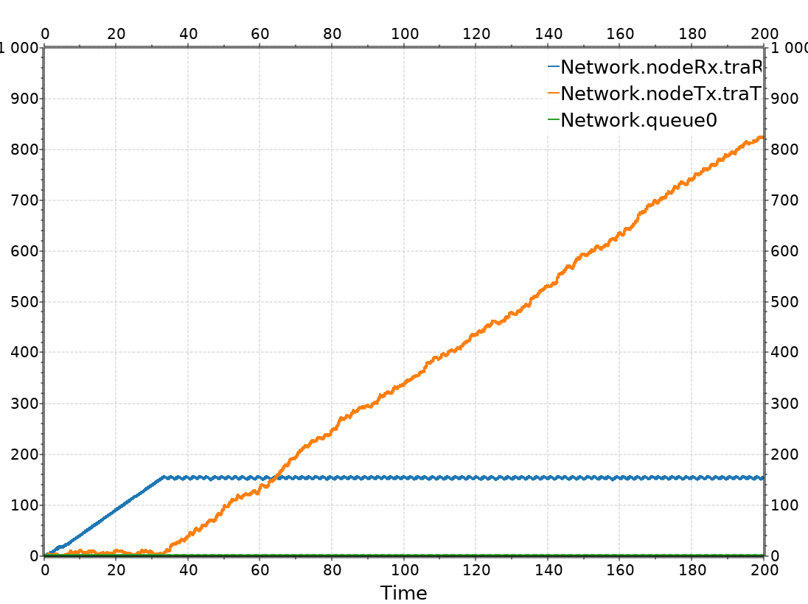
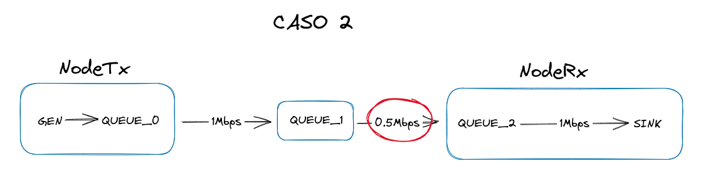

# Simulacion de red simple

## Autores
- [Juan Pablo Ludueña Zakka](mailto:juan.luduena.161@mi.unc.edu.ar)
- [Pedro Salas Piñero](mailto:pedrosalaspinero@mi.unc.edu.ar)
- [Lautaro Ebner](mailto:lautaro.ebner@mi.unc.edu.ar)

## Abstract
En este trabajo de investigacion, buscamos resolver un problema de congestion en una red simple, haciendo  mediciones para identificar el problema, encontramos que se mandan mas mensajes de los que se pueden procesar, generando una perdida de paquetes en el camino. Es por esto que proponemos una via de comunicacion desde el receptor al transmisor y a traves de esta via, ajustar cuantos mensajes por segundo mandar.

Luego de implementar nosotros esta solucion, hicimos las mediciones necesarias y concluimos que en verdad la situacion mejoro, pero estamos al tanto que la solucion dada no es portable a otras redes de mayor tamaño o mayor complejidad.

# Introduccion
En este laboratorio, experimentamos con control de **flujo** y **congestion** en una red simple que consta de un generador y un receptor conectados por un nodo intermedio. 

Para esto lo dividimos en dos partes:

1) Reconocimiento del problema segun dos casos de estudio.
2) Mediciones despues de implementar dichos algoritmos.

### Reconocimiento del problema:
Primero debemos entender la estructura general de la red que estudiamos, y daremos etiquetas que usaremos para referirnos a las distintas partes.

La red en cuestion tiene tres nodos, uno transmisor que llamaremos **nodoTx**, una cola que servira como nodo intermedio, que llamaremos **queue** y un ultimo nodo receptor que llamaremos **nodoRx**.

Cada uno de los nodos Tx y Rx tienen sus respectivas colas internas que sirven para darles distintas capacidades de generacion y procesamiento respectivamente.

 

### Primer caso de estudio
Fijamos la capacidad de **queue** a **1Mbps**, y la capacidad de procesamiento de **nodoRx** en **0.5Mbps**. Luego de establecer estos parametros, vamos variando el timeout en el que **nodoTx** genera paquetes de datos. **Llamaremos a este valor G.**

| G = 0.1                             | G = 0.2                           | G = 0.3                            |  
| :---------------------------------: | :-------------------------------: | :--------------------------------: |
|  || |
|  || |

### Segundo caso de estudio
Fijamos la capacidad de **queue** a **0.5Mbps**, y la capacidad de procesamiento de **nodoRx** en **1Mbps**. Luego de establecer estos parametros, vamos variando el timeout en el que **nodoTx** genera paquetes de datos. **Llamaremos a este valor G.**

| G = 0.1                             | G = 0.2                             | G = 0.3                             | 
| :---------------------------------: | :---------------------------------: | :---------------------------------: |
|  |  |  |
|  |  |  |

### Conclusiones sobre las métricas
Claramente, en el primer caso se genera una saturacion del buffer de nodoRx, y se satura su entrada. Es por esto que la queue interna de nodoRx empieza a descartar paquetes. 

Tambien podemos ver que en la segunda hilera de graficas tenemos una visualizacion donde podemos ver los paquetes enviados (naranja) y los paquetes recibidos (azul). Ademas podemos ver que independientemente de dónde se genera una congestion, la razon por la que se pierden paquetes es la misma.

Como vemos en las mediciones, cuanto mayor es el tiempo de generacion de paquetes, menor es la perdida de los mismos.

El problema entonces es que se **envian mas paquetes de los que se pueden procesar**. Una buena solucion apunta a los siguientes objetivos:

1) Minimizar perdida de paquetes.
2) Maximizar el uso de la red.

## Propuesta de solucion

Para controlar el flujo de paquetes en esta red, proponemos el uso de una via de comunicacion entre el receptor (nodoRx) y el transmisor (nodoTx). Para esto, ambos modulos requieren ser modificados, ademas de que ahora usaremos una nueva cola para esta via de comunicacion.

Esta red seria de esta forma: 

Y los nodos modificados se ven asi:

De esta forma, podemos hacer que cuando el **nodoRx** se concidere saturado mande una señal al **nodoTx** para que deje de enviarle paquetes por un cierto periodo de tiempo.

**En particular implementaremos lo siguiente: cuando el buffer de nodoRx llegue al 77% de su capacidad, le envia un mensaje de feedback al nodoTx, para que este deje de transmitir mensajes durante un segundo.**

### Hipotesis de funcionamiento

Tenemos nuestra nueva red, ahora esperamos ver una mejora con respecto a las mediciones anteriores, al tratar que no se sature nunca el buffer de nodeRx, deberiamos perder menos paquetes que antes, sin embargo, la cantidad de paquetes recibidos deberia ser la misma, dado que depende de la capacidad de la red. Con respecto a maximizar el uso de la red, vamos a ver si se logra o no, para lo que haremos las mediciones sobre los mismos casos de estudio. 
Evaluaremos luego de las modificaciones, si cumplimos las siguientes hipotesis:

> **Hipotesis 1:** Se perderan menos paquetes
amos la capacidad de queue a 0.5Mbps, y la capacidad de procesamiento de nodoRx en 1Mbps. Luego de establecer estos parametros, vamos variando el timeout en el que nodoTx genera paquetes de datos. 

En es

### Primer caso de estudio
Al igual que antes fijamos la capacidad de **queue** a **1Mbps**, y la capacidad de procesamiento de **nodoRx** en **0.5Mbps**. Luego de establecer estos parametros, vamos variando el timeout en el que **nodoTx** genera paquetes de datos. **Llamaremos a este valor G.**

| G = 0.1                             | G = 0.2                             | G = 0.3                             |  
| :---------------------------------: | :---------------------------------: | :---------------------------------: |
|  |  |  |
|  |  |  |

En el caso **G = 0.1**, ase nota que los paquetes que se perdian originalmente en las mediciones, ya no se perdieron. 

### Segundo caso de estudio
Fijamos la capacidad de **queue** a **0.5Mbps**, y la capacidad de procesamiento de **nodoRx** en **1Mbps**. Luego de establecer estos parametros, vamos variando el timeout en el que **nodoTx** genera paquetes de datos. **Llamaremos a este valor G.**

En este caso, las mediciones fueron **exactamente** las mismas que en la medicion previa a modificar el modelo.

### Hipotesis 1:

En el primer caso de estudio, podemos ver que se cumple la hipotesis, porque los paquetes, aunque se generan, no son enviados sino que se quedan en la cola del **nodoTx**. Luego, en el segundo caso de estudio, tambioen se cumple la hipotesis (no empeora). Esto se da porque el punto en el que se genera la congestion y la perdida de paquetes, esta fuera del **nodoRx**, por lo tanto, nadie le "comunica" al nodoTx que comience a guardar los paquetes que todavia no puede mandar.

Entonces, podemos ver que nuestra solucion funciona cuando el nodo que se comunique con el nodo generador sea el **mismo nodo** que sufre la congestion, no necesariamente el ultimo nodo en la conexión (receptor). 

### Hipotesis 2:

Gracias al control de congestion, logramos mejorar en un caso especifico la **perdida de paquetes**, pero no afectamos en ningun momento la capacidad real de la red en general, es decir el flujo maximo de paquetes es el mismo, la velocidad a la que se mueven es la misma, por ende, se cumple la hipotesis 2. La modificacion de la red no afecta a su rendimiento.

# Discusión y Preguntas del enunciado

En conclusion, tenemos que la modificacion planteada para solucionar el problema, logra que los paquetes no se pierdan temporalmente, sin embargo, pudimos ver que no es una buena solucion por los siguientes motivos: 

**No adaptabilidad:** la solucion dada funciona para una situacion demasiado especifica. Proponemos para generalizar la solucion, que el mensaje de congestion se pueda enviar desde cualquier nodo intermedio hacia atras. Ademas, que cada mensaje de congestion tenga informacion sobre la capacidad de procesamiento de datos que tiene el nodo que envia el mensaje (ie. capacidad restante), para asi ajustar dinamicamente los parametros del envio de paquetes.

**Los paquetes, ¿A dónde van?** Es importante lograr que no se pierdan paquetes, pero tambien es cierto que no se estan enviando, esta solucion es muy dependiente del tamaño del buffer del nodo generador (**nodoTx**) porque cuando el nodo no manda paquetes, los guarda en su propio buffer (el cual es de gran tamaño) y de seguir la simulacion por mucho tiempo o con paquetes de mayor tamaño, los paquetes se perderian igual.

### Preguntas: 
> ¿Qué diferencia observa entre el caso de estudio 1 y 2? ¿Cuál es la fuente limitante en cada uno? 

La diferencia principal es la ubicacion de la congestion. En el caso 1 se encuentra dentro del nodoRx (**sink**) porque "procesa" los paquetes a una velocidad menor, mientras que en el caso 2 la congestion se da en la conexion entre **queue** y **nodoRx**, porque la capacidad de transferencia de esa conexion es menor a la capacidad de transferencia de **nodoTx**.

Para ilustrar exactamente en donde esta el problema, hicimos esta grafica:

Luego, en el segundo caso, ocurre algo similar pero en otra seccion de la red.

> ¿Cómo cree que se comporta su algoritmo de control de flujo y congestión ? ¿Funciona para el caso de estudio 1 y 2 por igual? ¿Por qué?

El algoritmo de control de flujo y congestion que nosotros implementamos, implementa una nueva cola (**queue_1**) que sirve de vía de comunicacion entre los nodos **nodoTx** y **nodoRx**. En particular, cuando el **nodoRx** recibe un paquete que haga que su capacidad sea del **77%** envia el mensaje feedback. Luego, cuando el **nodoTx** recibe ese mensaje, decide no enviar paquetes hasta que haya pasado **un segundo**, en vez de tirarlos, los guarda en su propio buffer, esperando a ser mandados.

En un principio el algoritmo nos parecio que solucionaria el problema en ambos casos, pero luego notamos, como se ve en las ilustraciones de cada caso, que la congestion se encuentra en dos lugares distintos, suficientemente distintos para que la solucion no afecte al caso 2. Como **nodoRx** no se entera de la congestion (porque pasa antes), no puede mandar ningun aviso sobre la congestion.

# Referencias

## Fuentes

1) Documentacion oficial de Omnet++
2) Enunciado del Laboratorio
3) Tannenbaun
4) Videos recomendados por la catedra
5) StackOverflow, otros foros online. 
6) Usamos tambien una herramienta de "sketchs" online llamada [excalidraw](https://excalidraw.com/), la cual no guarda los dibujos realizados 
